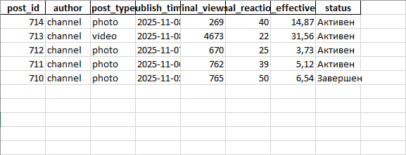

# Бот для анализа эффективности мемоделов в телеграмм канале
Автоматическая система анализа эффективности мемоделов, для дальнейшего распределения среди них зарплаты с рекламы
___
## О проекте
Бот был специально разработан для моего канала [Частная Мемодельная Компания](https://t.me/PMemeCom). ЧМК представляет из себя хаб для мемоделов, где постяться оригинальные мемы. С подключением монетизации встанет вопрос о распределении дохода среди мемоделов и именно для этого и была создана эта система.
___
### Как это работает
Бот сидит в администраторах канала и парсит посты за последние 48 часов и обновляет их статистику раз в час. По прошествии 48 часов парсинг поста останавливается и с помощью специальных формул высчитывается эффективность. В конце месяца цифры эффективности складываются и так находится доля от дохода для каждого мемодела.
___
### Подробно
## **config.py**
Файл для настроек бота для подключения к Telegram API
## **parser.py**
Сначала парсер ищёт "Активные" посты, которым меньше 48 часов `def parse_active_posts(self)`. После нахождения идёт парсинг одного поста`def parse_single_post` из него достаётся: id поста, автор, тип поста, кол-во просмотров, кол-во реакций, и время постинга.
## **analytics.py**
Потом наступает время аналитики, он находит нынешнее кол-во подписчиков для будущих расчётов, после начинает считать эффективность по двум формулам:
1. `def default_formula` Дефолтная формула применяется, если пост не репостнули.
Default_formula = reactions / views
2. `def repost_formula` Репост формула применяется, если пост бы репостнут.
Repost_formula = 1 - (multiplier * self.current_subscribers / views)
Здесь 1 как бы "переворачивает" значения, так как без единицы получалось, что чем больше просмотров, тем меньше значение, а должно быть наоборот. "multiplier" мультипликатор для кол-во подписчиков предназначен для того, чтобы значения принимали примерно 3*default_formula, так как стоимость поста, которого репостули это три обычных.
## **database.py**
Датабаза создаёт excel файл, где удобно смотреть на статитсику:


На нём мы видим, пост 711, который уже не обновляется и имеет статус "Завершен". Также пост 713, который был репостнут и имеет 4673 просмотра, эффективность поста выходит 31,56. Пост 714 является дефолтным, но так как он набрал 40 реакций на 270 просмтров он оценивается на 14,87.
## **performance_analytics.py**
Это уже сам код бота, через него запускаются все процессы
___
### В разработке
Сейчас это скорее не бот, а приложение, который через клиент юзера парсит тг канал. Почему не бот? Телеграмм не даёт ботам парсить нормально, поэтому буду искать обходные пути и может даже прибегну к API TGStat.
Так же надо привязать к Гугл Таблицам, чтобы мемоделы тоже могли смотреть на статистику
Найти способ получения кол-во подписчиков не прибегаю к парсингу веб старницы(Сейчас кол-во подписчиков константа 1400)
Найти способ определения автора поста, так как сейчас автором поста выступает Channel, хотя подпись подстов присутствует
### Установка
```
pip install telethon python-dotenv pandas openpyxl schedule asyncio
```
Запуск
```
python performance_analytics.py
```

Честно признаться свайбкодил я датабазу.py, так как с sql мало знаком и также свайбкодил немного весь код, чтобы исправить все ошибки и код работал. Это, кстати, первый мой такой большой проект
